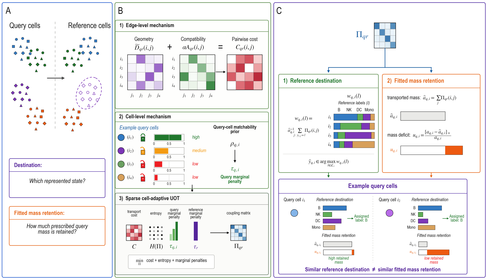

# CoRe-OT

Source code for **CoRe-OT: unbalanced optimal transport for single-cell mapping under incomplete reference coverage**.

CoRe-OT (correspondence-aware reference mapping by optimal transport) uses prior-informed unbalanced optimal transport to assess query-cell support in a single-cell reference. Its weak-correspondence scores depend on the fitted model and inputs; they are not probabilities of biological absence.



## Installation

Requires Python 3.11 or 3.12 and [uv](https://docs.astral.sh/uv/).

```bash
git clone https://github.com/wtding1998/coreot-paper-release.git
cd coreot-paper-release
uv sync --locked
```

Inspect the pipeline and run the code tests:

```bash
uv run coreot steps
uv run pytest
```

## Usage

The Python solver accepts query–reference candidate pairs, their costs, prescribed cell masses and marginal penalties. In the API, `source` means query and `target` means reference. Save this small synthetic example as `example.py` and run `uv run python example.py`:

```python
import numpy as np
from coreot.transport.sinkhorn import solve_sparse_unbalanced_sinkhorn

# Two query cells and two reference cells; include every candidate pair.
query_index = np.array([0, 0, 1, 1])
reference_index = np.array([0, 1, 0, 1])
distance = np.array([0.1, 1.0, 0.8, 0.2])  # scaled embedding distances
query_anchor = np.array(["A", "B"])
reference_anchor = np.array(["A", "B"])
anchor_cost = (query_anchor[query_index] != reference_anchor[reference_index]).astype(float)
rho = np.array([0.9, 0.4])  # query-cell matchability priors in [0, 1]
query_mass = np.full(2, 0.5)
reference_mass = np.full(2, 0.5)

fit = solve_sparse_unbalanced_sinkhorn(
    source_index=query_index,
    target_index=reference_index,
    cost=distance + 0.5 * anchor_cost,
    source_mass=query_mass,
    target_mass=reference_mass,
    epsilon=0.05,
    tau_source=0.05 + (1.0 - 0.05) * rho,
    tau_target=np.full(2, 1.0),
    max_iter=2000,
    tol=1e-6,
)
deficit = np.maximum(query_mass - fit.source_marginal, 0.0) / query_mass
print("Converged:", fit.converged)
print("Candidate-pair transport weights:", fit.coupling)
print("Query-marginal deficit:", deficit)
```

For your own data, replace the candidate indices, scaled distances, broad-anchor labels, matchability priors and cell masses; indices must follow the corresponding cell order. This example uses hard broad-anchor labels with unit confidence and illustrative parameter values. Larger deficit indicates weaker fitted reference support. Check `fit.converged` before interpreting the output; this is a solver example, not a complete preprocessing or label-transfer workflow.

## Data and reproducibility

Run all commands from the cloned repository root. Biological data are not included in Git.

### Download inputs

Create the input directories:

```bash
mkdir -p data/raw data/models/celltypist data/derived/hiha_dc
```

Download each file below and save it at the indicated path, relative to the repository root. These are the acquisition URLs recorded in the [external-data manifest](paper-release/provenance/external_dependencies.csv); their current remote availability has not been reverified.

| Input | Download | Save as |
| --- | --- | --- |
| HIHA dendritic cells | [Allen Institute](https://allenimmunology.org/public/publication/download/84792154-cdfb-42d0-8e42-39e210e980b4/filesets/568ad40c-516a-4646-9426-bdcd7029c1f5/human_immune_health_atlas_dc.h5ad) | `data/raw/human_immune_health_atlas_dc.h5ad` |
| AIFI Level-2 CellTypist model | [Allen Institute](https://allenimmunology.org/public/publication/download/84792154-cdfb-42d0-8e42-39e210e980b4/filesets/c5300f8b-f5ff-4010-9371-edc33d489143/ref_pbmc_clean_celltypist_model_AIFI_L2_2024-04-19.pkl) | `data/models/celltypist/ref_pbmc_clean_celltypist_model_AIFI_L2_2024-04-19.pkl` |
| Processed Kang PBMC object (GSE96583) | [Figshare file used by the release](https://api.figshare.com/v2/file/download/34464122) | `data/raw/kang_2018.h5ad` |
| Mouse-spleen RNA | [MultiMAP RNA](ftp://ngs.sanger.ac.uk/production/teichmann/MultiMAP/rna.h5ad) | `data/raw/rna.h5ad` |
| Mouse-spleen ATAC gene activity | [MultiMAP gene activity](ftp://ngs.sanger.ac.uk/production/teichmann/MultiMAP/atac-genes.h5ad) | `data/raw/atac-genes.h5ad` |
| Mouse-spleen ATAC peaks | [MultiMAP peaks](ftp://ngs.sanger.ac.uk/production/teichmann/MultiMAP/atac-peaks.h5ad) | `data/raw/atac-peaks.h5ad` |

The mouse-spleen studies are E-MTAB-9769 and E-MTAB-6714. Use an FTP-capable client for the recorded MultiMAP URLs. Compare downloaded files with the SHA-256 values in the manifest, for example with `shasum -a 256 data/raw/kang_2018.h5ad`.

### Prepare HIHA prediction scores

After downloading the HIHA object and CellTypist model above, run:

```bash
uv run python scripts/recompute_aifi_l2_score.py \
  --input-h5ad data/raw/human_immune_health_atlas_dc.h5ad \
  --model-pkl data/models/celltypist/ref_pbmc_clean_celltypist_model_AIFI_L2_2024-04-19.pkl \
  --output-h5ad data/derived/hiha_dc/hiha_dc.rebuilt.h5ad
```

This writes a new AnnData object containing predicted Level-2 labels and scores, plus a per-cell TSV report beside it. Use a new output filename for each run. The script records a creation timestamp and software versions, so its output is not byte-identical to the historical processed file required by the archive's strict checksum validation. Keep the rebuilt file separate from that historical input; this preparation command does not close the archive-reproduction requirement below.

### Obtain the required reproduction resources

The artifact-regeneration workflow also requires resources whose public download locations are still pending:

- **Complete evidence archive:** extract it so that `evidence/release/` contains `units/`, `code/`, and `provenance/`, including `provenance/checksums.sha256`. Set `--release-root` to that directory, not this source checkout.
- **Recorded processed HIHA object:** place it at `data/derived/hiha_dc/human_immune_health_atlas_dc.with_recomputed_AIFI_L2_score.h5ad`. The workflow requires the exact file identity recorded in the manifest. Neither the raw HIHA download nor a newly rebuilt file can substitute for it under the current checksum validation.

Until these resources are accessible, a fresh clone plus the downloads above cannot reproduce all results.

### Regenerate results from saved fits

Once those resources are in place, run:

```bash
uv run python -m paper-release.workflows.reproduce \
  --release-root evidence/release \
  --output-root reproduced \
  --unit all \
  --pbmc-source-h5ad data/raw/kang_2018.h5ad \
  --hiha-source-h5ad data/derived/hiha_dc/human_immune_health_atlas_dc.with_recomputed_AIFI_L2_score.h5ad
```

The `reproduced/` directory must not already exist and must be outside the extracted evidence archive. Outputs are written under `reproduced/<unit_id>/`; inspect `reproduced/unit_status.csv` and `reproduced/session_report.md` for completion and any failures. This command regenerates artifacts from saved fits; it does not refit the models. The mouse-spleen regeneration units consume packaged artifacts rather than the raw downloads. Passing the code tests alone does not establish reproduction of manuscript results.

## License and citation

Code: [MIT](LICENSE). Author-created documentation and evidence: [CC BY 4.0](LICENSES/CC-BY-4.0.txt), subject to the [license scope and exclusions](LICENSE_SCOPE.md).

Authors: Zhili Lin and Zhouxiang Jin. See [CITATION.cff](CITATION.cff) for citation metadata; publication details and DOI are pending.

Contact: Zhili Lin — [lzlwork12138@163.com](mailto:lzlwork12138@163.com).
